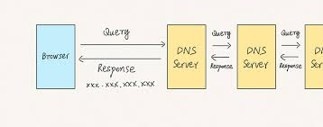

# The activity that takes place after typing **google.com** then Enter button.

This activity goes through a process known an **DNS**(Domain Name System)
DNS- is the process of translating a website domain <mark>eg,. google.com</mark> into an ip address like (142.231.7.100),its like a phone book for the internet, connecting human-friendly names to numerical addresses.


## How it works:

## 1. Your browser sends a request:
When you type a domain name into your browser <em>eg. google .com</em>, your computer first checks its own cache to see if the IP address is already stored. If not, it sends a request to your local DNS server.

When the user presses enter on the browser having written <em>https://www.google.com</em> the browser sends diffrent message to the server.

The url is divided into diffent parts

1. The <mark>Get / HTTP/</mark>
- Informs the server that you're requesting the homepage(/) from google using the get method.
2. The <mark>Host: www.google.com</mark>
- Tells the server which domain you're acessibg.
3. Accept,encoding and Accepting language 
- These tells the server what type of content the browser can handle
- What compression the browser can handle
- Indicates the preferred  language for the content.


## 2. Local DNS server:
This server acts as the first point of contact. It might already have the information in its cache. If not, it will query other DNS servers to find the IP address. 
Local DNS server is usually  provide by

- isp (internet service provider)
- A pub;ic DNS service,  <em>eg. like Google DNS</em>

### Steps Involving the Local DNS Server Only

#### 1. Check Browser Cache
The browser first checks if it already knows the IP address of **google.com**.

#### 2. Check OS DNS Cache
If not in the browser, the operating system checks its local DNS cache.

#### 3. Query Sent to Local DNS Server
If still not found, the OS sends a DNS query to the local DNS server (configured in your network settings).

Example DNS query:

```bash
What is the IP address of www.google.com?
```

#### 4. Local DNS Server Responds
*TLD* TOP LEVEL DOMAIN
If the local DNS server already knows the IP (from its own cache), it returns it directly.

If not, it recursively contacts other DNS servers (root, TLD, authoritative) to find the IP.

Example DNS response:
```bash
www.google.com → 142.250.196.68
```


<mark>note</mark>The local DNS server does all the hard work (recursion) — your browser only waits for the final answer.


## 3. Recursion:
The local DNS server may recursively query other DNS servers (like root nameservers) to locate the IP address.
##### Steps in Recursive DNS Resolution
Client Request
The computer/browser sends a request to the local DNS resolver:
What is the IP address of www.google.com?

Check Cache
Local DNS checks its cache. If it has the answer, it returns it.

If Not Cached – Start Recursion
The local DNS server performs the following queries:

Root DNS Server:
-  Asks where to find .com domain info.

TLD Server (.com):
-  Asks where to find google.com info.

Authoritative Server (google.com):
- Asks for IP of www.google.com.

Return Answer to Client
The final IP address is returned to your computer.

- Key Servers Contacted During Recursion 
Server Type	Purpose
Root DNS Server	Directs to TLD servers
TLD Server (.com)	Directs to authoritative servers
Authoritative Server	Gives the final IP address

## Features of Recursive DNS
- The local DNS server does all the work (recursive process).
- The client only makes one query.
- Efficient for clients, but more load on DNS resolver.
- Results are cached to speed up future queries.


## 4. IP address found:
Once the IP address is found, it is returned to your local DNS server and cached. Your local DNS server then sends the IP address back to your computer. 

- Authoritative DNS Server replies

It sends the final IP address for the domain (e.g., www.google.com → 142.250.196.68)

This response goes back to the recursive DNS server.

- Recursive DNS Server receives the IP

It stores (caches) the result for future requests.

Prepares a DNS response message for the original client (your computer).

- Recursive DNS Server sends IP back to Client

- Client Computer receives the IP address

Your operating system stores it in its DNS cache.

The browser now uses the IP address to start an HTTP/HTTPS connection to that server.

- **NOTE**Key Points:
The IP is sent from the recursive DNS server back to the computer.

The protocol used is usually UDP, unless the response is too large (then TCP is used).

The browser now knows exactly which IP address to connect to

## 5. Connection established:
The browser uses the IP address to connect to the website establishing a Connection (After DNS Resolution)

###### Step 1: Browser Gets IP Address

After DNS recursion, the computer now knows:

```bash
www.google.com → 142.250.196.68
```

###### Step 2: TCP Connection (3-Way Handshake)
The browser uses this IP to establish a TCP connection with the server:

3-Way Handshake:

SYN – The computer sends a "synchronization" packet to the server asking to start a connection.

SYN-ACK – The server responds with "SYN-ACK (asynchronization acknowledge)" to accept the connection.

ACK – The computer replies with "ACK", completing the connection.

- Now the TCP connection is established.

###### Step 3: TLS Handshake (if HTTPS)
Browser initiates a TLS (transport layer security) handshake.

Encryption keys are exchanged securely.

Server identity is verified using its digital certificate.

 ###### 4. Browser Sends the Web Request
The browser sends a request to the server asking for the homepage.

This request includes:

The path or page you want (example: /)

Information about the browser and what content to accept.


###### 5. Server Responds with the Webpage

The server understands the request and sends back a response.

The response includes:

A status message (example: "Success")

The content of the page (HTML, images, styles, etc.)

The browser then displays the webpage to you. 